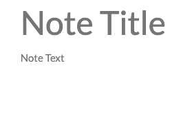
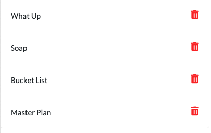

# Note-Taker

### This application runs in your browser, and allows you to create and save notes for yourself

### When you first start the app, you'll be greeted with this image

### Click "Get Started" to... get started.

### To write a note, it needs both a Title, and the actual content of the note.

### Click on the text fields given to you, 

### and type that information in

### Once you've typed your note, a Save button will appear in the upper right hand corner

### If you want to delete what you've written and start over, click the pen icon next to it

### After you saved, the note can be displayed by clicking its title on the left sidebar

### All your saved notes can be selected from there

### To delete a note, press the delete button on the right of the title display
